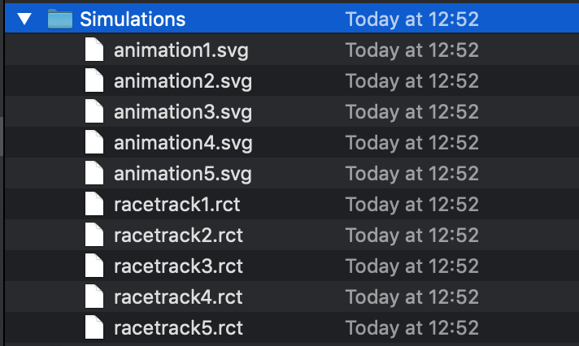

  
# Circle Driver 

Circle Driver is a project aiming to have fun coding together with your friends and improving your own skills at the same time. This is the first such project created as part of "The riddle of the Sprint" initiative.

- [Installation](#installation)
- [Task](#task)
- [Debugging](#debugging)
- [Example](#example)
- [License](#license)

## Installation
```
git clone https://github.com/pawelini1/CircleDriver.git
cd CircleDriver
swift build
.build/debug/racetrack
```
## Task

 1. Add your library to Package.swift (see `JustGoTowardsCircleDriver` example)
 2. Implement `CircleDriverProtocol` providing your logic for driving the circle to the destination point avoiding collisions with all obstacles. (see `JustGoTowardsCircleDriver.swift`)
```
public  protocol  CircleDriverProtocol {
    var name: String { get } // Name of your driver
    func movement(for circle: Circle, // You current circle state (position)
                  goingTo destination: Point, // Point you show go to
                  withMaximumStep maximumStep: Step, // Maximum step length
                  avoidingCollisionsWith obstacles: [Obstacle] // Current state for all obstacales
    ) -> Movement
}
```
 4. Add you driver object to `DriversProvider.swift`. All simulations will be performed for all drivers returned by that provider, so while testing you can remove all of them leaving only your drivers. You can test few drivers at the same time if you have more than one driver conforming to `CircleDriverProtocol`
 5. In each iteration you'll be asked to return `Movement` object representing the step length and direction when your circle should go.
 6. You main objective is to reach the destination as quickly as possible without colliding into any obstacle.

## Debugging

If you want to test you current implementation you can use the racetrack executable available in the repository

There are two commands available:

 1. `racetrack run <n: Int>` which runs the `n` simulations showing the results on the console
```
Options:
--animation <value>  defines the file to save simulation animation (SVG) e.g. 'animation.svg'
--area <value> [AUTO-GENERATED] defines area used as race track e.g. '0,0,1000,1000'
-h, --help Show help information
--iterationsLimit <value>  [AUTO-GENERATED] defines the maximum number of iterations in simulation e.g. '1000'
--maxStep <value>  [AUTO-GENERATED] defines maximum step for the circle in one movement e.g. '10'
--obstacles <value>  [AUTO-GENERATED] defines number of obstacles to generate e.g. '5'
--racetrack <value>  defines the file to save simulation parameters e.g. 'simulation.rct'
--radius <value> [AUTO-GENERATED] defines the range for radius e.g. '1.0...5.0'
--stepTime <value> [AUTO-GENERATED] defines the time of one iteration of simulation in seconds e.g. '0.05'
-v, --verbose  enables printing more precise log messages
```

 2. `racetrack rerun --racetrack ~/Desktop/racetrack.rct` which runs the simulation with parameters from provided file (useful when debugging fail scenarios)
```
Options:
--animation <value>  defines the file to save simulation animation (SVG) e.g. 'animation.svg'
-h, --help Show help information
--iterationsLimit <value>  [AUTO-GENERATED] defines the maximum number of iterations in simulation e.g. '1000'
--open defines whether to open the animation after the simulation
--racetrack <value>  [REQUIRED] defines the file to load simulation parameters e.g. 'simulation.rct'
--stepTime <value> [AUTO-GENERATED] defines the time of one iteration of simulation in seconds e.g. '0.05'
-v, --verbose  enables printing more precise log messages
```

## Example

Running 5 simulations and saving animation and racetrack files.
```
WHM0004957:CircleDriver pszymanski$ .build/debug/racetrack run 5 --animation ~/Desktop/Simulations/animation.svg --racetrack ~/Desktop/Simulations/racetrack.rct
Simulation #1
[JustGoTowardsCircleDriver at 1.0 of max speed] Simulation completed with result: collision (after 174 iterations)
[JustGoTowardsCircleDriver at 0.5 of max speed] Simulation completed with result: collision (after 141 iterations)
Simulation #2
[JustGoTowardsCircleDriver at 1.0 of max speed] Simulation completed with result: collision (after 150 iterations)
[JustGoTowardsCircleDriver at 0.5 of max speed] Simulation completed with result: finished (after 584 iterations)
Simulation #3
[JustGoTowardsCircleDriver at 1.0 of max speed] Simulation completed with result: collision (after 72 iterations)
[JustGoTowardsCircleDriver at 0.5 of max speed] Simulation completed with result: collision (after 117 iterations)
Simulation #4
[JustGoTowardsCircleDriver at 1.0 of max speed] Simulation completed with result: collision (after 56 iterations)
[JustGoTowardsCircleDriver at 0.5 of max speed] Simulation completed with result: collision (after 74 iterations)
Simulation #5
[JustGoTowardsCircleDriver at 1.0 of max speed] Simulation completed with result: collision (after 91 iterations)
[JustGoTowardsCircleDriver at 0.5 of max speed] Simulation completed with result: collision (after 127 iterations)
```
Simulation files:


One of the animations presenting one simulation:


## License

CircleDrver is released under the [MIT License](LICENSE.md).
